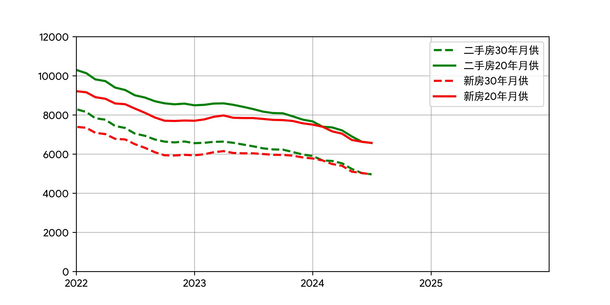

# 图表绘制工具

在更新个人资产及武汉市数据后进行相关图表的绘制，用于个人网站的信息展示

目前输出以下图表：

- 资产变化


- 资产配置


- 收入支出


- 武汉市房价指数


- 武汉市参考月供



## 使用

编辑配置文件：

```json
{
    "finance_data": "个人资产表的绝对路径",
    "finance_out": "图表的输出绝对路径（公开版本）",
    "finance_pri_out": "图表的输出绝对路径（内部版本）",
    "wuhan_out": "武汉市统计数据图表输出绝对路径"
}
```

注意：输出路径下均需要存在 `assets` 文件夹

其中公开版本输出的图表隐藏 y 轴，内部版本不会隐藏

## 依赖

数据读取需要3个excel，其模板在 `data` 路径中

## 运行建议

每天定时运行即可

